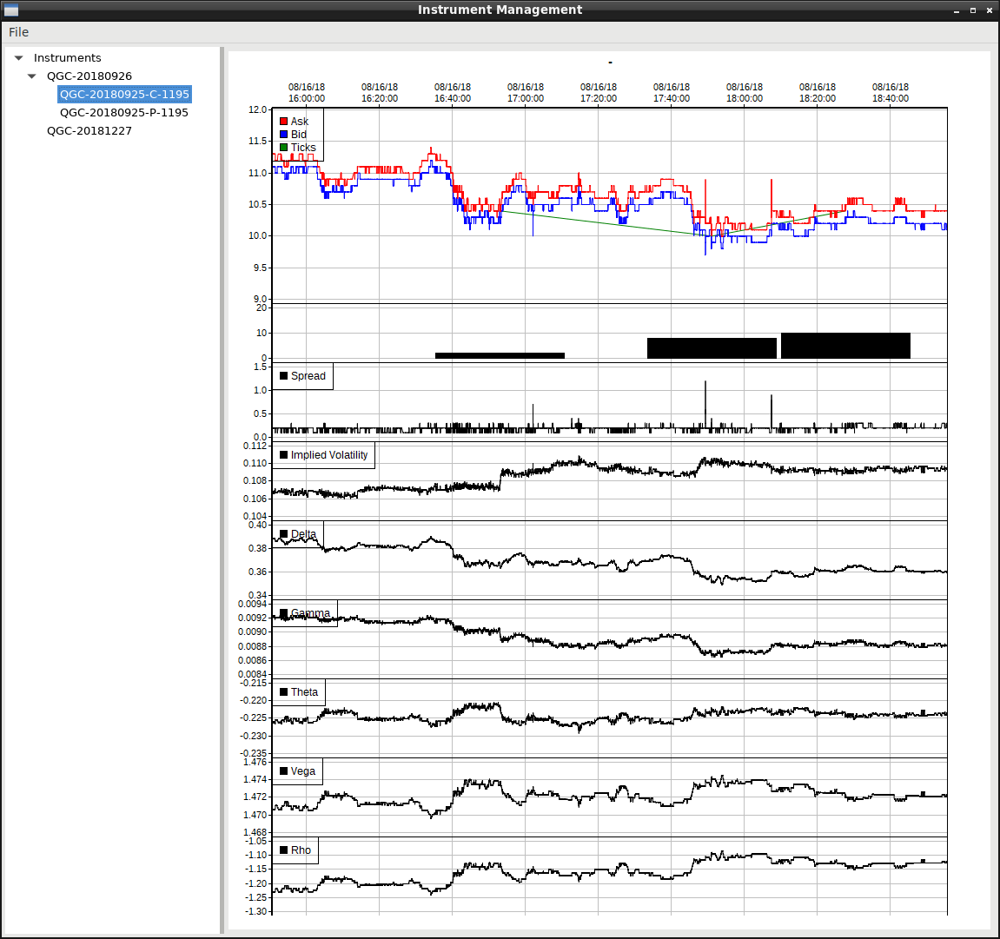

# trade-frame

## Introduction

This is a:
* library of functions to sink market data, organize time series, build indicators, author algorithms, and issue orders to a broker for high-capacity, low-latency trading applications
* collection of projects using the libraries to carry out various manual & automated trading scenarios

A primary goal of this solution is to provide a means of tracking an [Option Combo Order](lib/TFTrading/Order_Combo.hpp) through the birth to death life-cycle.  It is easy to enter into a option combo with Interactive Brokers with their user interface, but there does not seem to be an effective way to keep the legs grouped for tracking overall profit/loss.

This library provides a means of  a   with a .  Positions can be grouped together to form .  Portfolios representing Combos can be grouped together to represent the overall profit/loss of a trading Portfolio.

Positions are composed of a  class to record bid/ask/tick of .

 inherit from the Watch class to provide , which are computed in real time with an .

A [Simulation Interface](lib/TFSimulation/SimulationInterface.hpp) is provided for testing strategies off-line.  The simulator will accept [Orders](lib/TFTrading/Order.h) of type Market and Limit assuming bid/ask data has been captured from the exchange during a live session.  A 50ms - 100ms delay queue has been implemented to better simulate round-trip and slippage effects of order submission.

## Example

Picture from the ComboTrading project showing an instrument list, with a chart for one of the listed instruments.  Bid, ask, spread, and greeks are charted for the option (charted real-time).



More pictures under 

## Template

The AutoTrade project can be used as a template to building your own automated high-frequency trading application.

## Build Environment

A C++17 compiler is used to build the libraries and code. Initially, it was built on Windows a number of years ago,
but the focus changed towards supporting a Linux environment.  Some work will be needed to make it build on Windows again.

CMake is used for build management.

Note the use of '-march=native' in the root CMakeFiles.txt.  This will cause code to be not necessarily transportable across CPU types.  Comment out the option if you intend to compile across CPU types, ie, various releases of the Intel instruction set.
See the referenced URL for the variety of instructions across CPU releases.

## Building

Scripts are library version specific.  Build notes are as of 2021/11/22.
There are some wxWidget requirements for using a GTK variation of video drivers (I've used Nvidia and Radeon cards successfully).

You'll need to have about 10G drive space free to build the project, the related libraries,
as well as the installs (from my libs-build repository).

Debian Bookworm is used as the platform.  The library installer is specific to this distribution.
The installer may or may not work with other distributions or flavours.

DTN/IQFeed requires Wine to run.  Starting with the 6.2 release of IQFeed, wine32 is no longer required.
An x64-only installation of wine may generate some wine32 messages and errors, but they can be ignored.


```
# run with bash
# git for latest code, wine for IQFeed daemon
sudo apt-get update && sudo apt-get install git wine64 wget ttf-mscorefonts-installer
wget http://www.iqfeed.net/iqfeed_client_6_2_0_25.exe
wine64 iqfeed_client_6_2_0_25.exe

# interactive brokers TWS for linux
wget https://download2.interactivebrokers.com/installers/tws/stable/tws-stable-linux-x64.sh
sh tws-stable-linux-x64.sh

# install and build initial environment and libraries
git clone https://github.com/rburkholder/libs-build.git
pushd libs-build
./build.sh tradeframe
# rdaf is required for the projects in the rdaf subdirectory - optional
# this is a large install, so recommended only for those interested in the CERN toolset
# will require manual installation of libtorch: https://pytorch.org/cppdocs/installing.html
./build.sh rdaf
# one example uses Wt web library as an interface - optional
# not a recommended install, but provided here as a reference web based app
./build.sh wt
popd

# main trade-frame code
git clone https://github.com/rburkholder/trade-frame.git
# if you have access to the up-to-date private library, use this instead:
# git clone https://github.com/rburkholder/tf2.git

# if you build manually (this is not required if you load the folder into vscode):
cd trade-frame
mkdir build
cd build
cmake ..
# use parallel to use more cpu cores
cmake --build . --parallel 4 --config Debug
# cmake --build . --parallel 4 --config Release   # alternate build flavour
# cmake --build . --target clean  # clean for rebuild
```

I use Visual Studio Code as my IDE.  I have the following extensions installed:
* C/C++ [Microsoft]
* clangd [LLVM Extensions]
* CMake [twxs]
* CMake Tools [Microsoft]

The clangd extension provides the language library to provide symbol lookup and cross-referencing.

I have notes for this combination at
  [Visual Studio Code with CMake and Clangd](https://blog.raymond.burkholder.net/index.php?/archives/1037-Visual-Studio-Code-with-CMake-and-Clangd.html)


## Starting Up

* Start the IQFeed daemon by starting Apps -> Wine -> Programs -> IQFeed -> Watchlist [or from the command line: wine ~/.wine/drive_c/Program\ Files/DTN/IQFeed/iqconnect.exe -autoconnect & ] Login with your credentials and checkbox the Save Username/Password and Autoconnect the first time
* Start Interactive Brokers TWS and connect to a paper trading account
  * Do Not use an active account for testing
  * when connecting via an application, you will need to go into the settings to enable the API, and to activate the port
* IQFeedMarketSymbols project:
  * run the app:
    * Actions -> New Symbol List Remote
    * the program will spend a few minutes downloading, parsing, and saving the latest IQFeed symbol list
    * lots of messages will be generated, no need to evaluate them, other than the summary stats at the end
    * File -> Exit
* IQFeedGetHistory project:
  * obtains daily ohlc values, used to refresh data
  * repeats the symbol download, which was done with IQFeedMarketSymbols
  * run the app:
    * ensure the iqfeed daemon is running (you should see active updates in the quote monitor)
    * 'turn on' IQF
    * Actions -> download n # of days:
      * 0 to download full history of symbol, can take a while
      * 10 to try a test
      * a symbol download will commence
      * there will be a couple of minutes of no activity while the symbol list is scanned
      * data for a series of symbols will start
      * once the message 'Process Complete' shows, the download is complete
    * 'turn off' IQF
    * File -> Exit
* more apps to be described here ...

## Background

Current Market Data Providers and Execution vendors:

* IQFeed: real time market data and historical data
* Interactive Brokers:  real time market data, real time order execution
* Alpaca: real time data and order execution
* Phemex: real time data, order execution (work in progress)

Securities types:

* Equities
* Options
* Futures
* Futures Options

Libraries used (use my lib-build respository to download and build the various dependencies):

* wxWidgets
* boost
* curl
* zlib
* hdf5
* sqlite (included in source)
* exelformat (included in source)
* rdaf aka ROOT - library from CERN providing the clang C++ interpreter - optional

NOTE: The code started out on Windows using Visual Studio, and is now predominately tested on Linux Debian.  Some work is required
to port back to Windows.  There are various Windows based artifacts in various directories.  They are not fully functional at this time.

The lib directory has a series of libraries I use throughout the various projects/applications.  Primary libraries include:

*  - manage trades, quotes, greeks, 
*  - simulation engine
*  - engine to talk to DTNIQ Feed for Level1 & Level2 data (ask me for a referral)
*  - engine to talk to IB
*  - some indicators
*  - wraps the HDF5 library for storing time series
*  - options calculations
*  - manages orders, executions, portfolios, positions, accounts,
*  - provides a number of forms, panels, and related user-interface elements
*  - wrapper around ChartDirector for plots and charts
*  - which is an ORM wrapper around a sqlite database for maintaining trading records

These are some of the currently supported applications:

*  - code as template for automated trading - start of some ML based work
*  - exploratory code for understanding currency trading concepts
*  - basics of trading multiple securities, such as various options strategies
*  - a work in progress for trading futures based options combinations
*  - view and trade with futures level II data
*  - use a level II ladder to trade futures
*  - console app to query IQFeed for possible dividend based equity investments
* Hdf5Chart - view the contents of the hdf5 data set
* LiveChart - view an instrument in real time
*  - automatically download and decompress the latest mkt_symbol.txt file from dtn/iqfeed
*  - load up with historical data for looking for trading ideas
* StickShift2 - some rough code for some option trading ideas
* HedgedBollinger - some experiments in futures, mostly tracking at the money implied volatility

The announcement on my blog:  http://blog.raymond.burkholder.net/index.php?/archives/679-trade-frame-c++-securities-trading-software-development-framework.html

Some other, possibly, related entries:  http://blog.raymond.burkholder.net/index.php?/categories/23-Trading

NOTE: During its infancy, the code used MFC (Microsoft Foundation Classes), some Berkeley DB code, and various other modules,
which I now no longer support.  The code remains in the repository for historical value, and for the time it might be
re-written for current use.

## Testing

* IQFeed testing: you can utilize the symbol TST$Y, this symbol sends a loop of data 24/7. (2019/03/12)

## Miscellandous

* 2022/07/16 additional package requirement (incorporated into libs-build/build.sh):
  * sudo apt install portaudio19-dev

* 2022/07/25 additional package requirement (incorporated into libs-build/build.sh);
  * sudo apt install libcrypto++-dev

